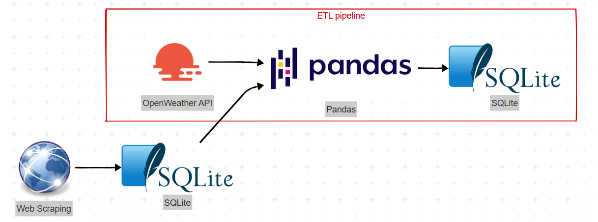

# 🌦 Weather Data Pipeline

## 📖 Overview
An **ETL pipeline** that collects **current and historical weather data** for a user-defined set of cities and chosen date ranges, storing it in **SQLite**.  
Built to practice **data engineering** skills with modern tools.

---

## 🛠 Tech Stack
🐍 Python • 📦 pandas • 🌐 requests  
🗄 SQLite  
☁️ OpenWeather API • 🕵️ Web Scraping

---

## 📐 Architecture

---

## 🚀 Features

- Choose how many cities to analyze  
- Select past or present dates for weather data collection  
- Historical + current weather records  
- Automated ETL from extraction to storage  
- Lightweight local storage with SQLite  

---

## 📊 Example Uses

- Weather trend analysis  
- Historical comparisons  
- Feeding machine learning models  
- Dashboard creation in Power BI / Tableau  

---

## 📜 License

Educational use only.  
Weather data from OpenWeather.
